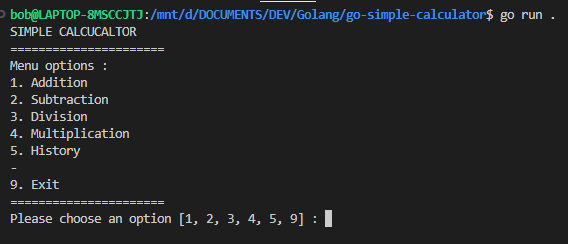
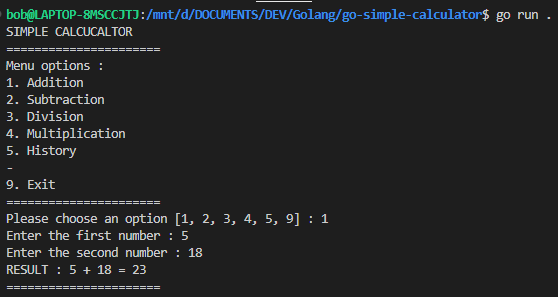
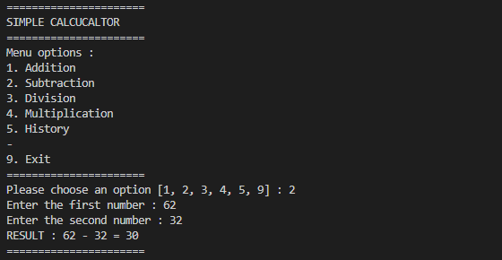
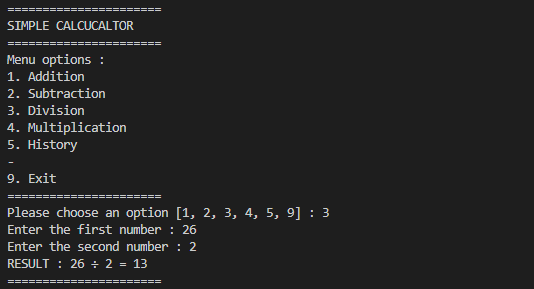
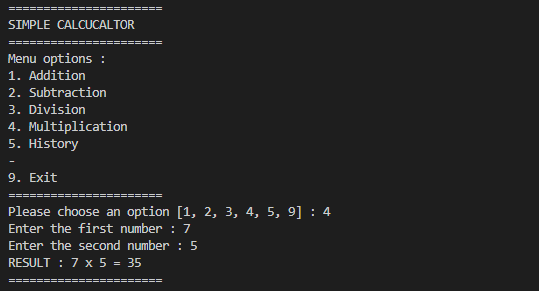
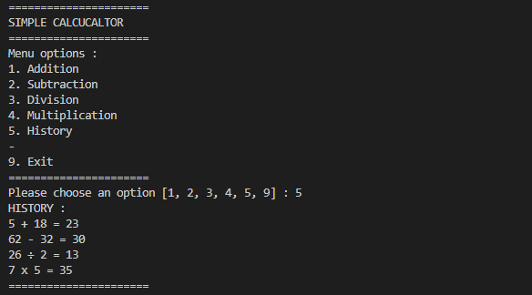
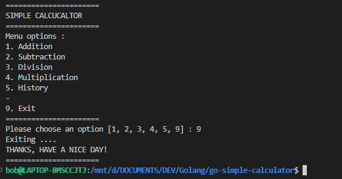

# Golang Simple Calculator App

Hi! I built a simple calculator app with Go Language for my learning journey where you can do some operations :

1. Addition (+)
2. Subtraction (-)
3. Division (÷)
4. Multiplication (x)

You can also see the history of your previous calculations.

# How to setup

- Clone this project with command

```
git clone https://github.com/libobz/go-simple-calculator.git
```

- Go to project directory with command

```
cd go-simple-calculator
```

- Open the project on your code editor
- Open the terminal and run the program with command

```
go run .
```

- It's gonna show you this :\

  \
- Please type an option [1 / 2 / 3 / 4] to choose an operator
- or type [5] to show the history of your previous calculations
- or type [9] to EXIT or end the program.
- If you choose 1, it will ask you 2 numbers to do an addition :\

  
- If you choose 2, it will ask you 2 numbers to do a subtraction :\

  
- If you choose 3, it will ask you 2 numbers to do a division :\

  
- If you choose 4, it will ask you 2 numbers to do a multiplication :\

  
- If you choose 5, it will show you the history of your previous calculations :\

  
- If you choose 9, it will EXIT or end the program :\

  

# ENJOY

Thank you for your kind attention, keep learning! :grin:
